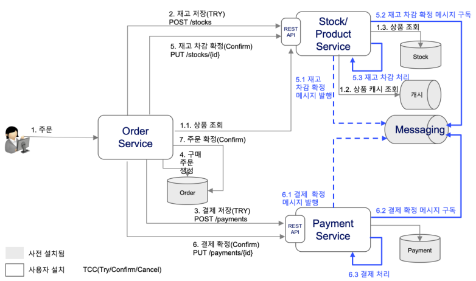
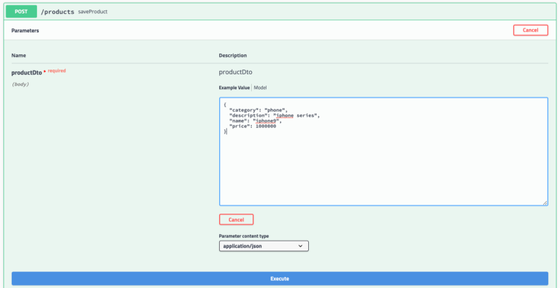

# stock microservice
Stock/Product Microservice for Cloud Native Post Academy Deep Dive

개요
분산된 마이크로서비스에서 일관성을 유지하기 위해 잘 알려준 방법으로 크리스 리차드처럼
이벤트 기반으로 하는것과 REST Try-Confirm/Cancel 기반의 분산 트랜잭션을 처리하는 방법이 있다.

이 학습에서는 REST 기반 분산트랜잭션을 처리하여 일관성을 유지하는 방법으로 구현된 3 개의 마이크로서비스를
컨테이터화 작업하는 것을 학습합니다.



## 필수작업
 1. App 관련 작성 규칙
   username을 기준으로 namespace로 만들고 자신의 앱을 배포하십시요
```
   1.1. namespace 작성 규칙 :
      user + NN( 일련번호 2자리)

      ex)
      - user01
      - user02
          :
      - user40

   1.2. app name 작성 규칙 :
      user + NN + "-" + post-fix (order|stock|payment  하나 선택)

      ex)
      - user01-order
      - user01-stock
      - user01-payment

   1.3. service name 작성 규칙
      app name과 동일하게 작성

      ex)
      - user01-stock

   1.4. configmap 작성 규칙
      app name + "-" + "config"
      app name 에 postfix("config" 명 추가)

      ex)
      - user01-stock-config

   1.5. YAML 파일 규칙 :
      userNN + appname(order|stock|payment 하나 선택) + ".yaml
      userNN + appname-service + ".yaml"
      userNN + appname-config + ".yaml"

      ex)
      - user01-stock.yaml
      - user01-stock-service.yaml
      - user01-stock-config.yaml
```

 2. iks 배포후 상품정보를 먼저 등록



 3. postgres db 접속 결과 확인

 4. kafka topic 조회
    kafka topic 정보를 조회합니다.
    kafka 정보
    * kafka name: kafka
    * zookeeper name: kafka-zookeeper

 5. redis 상품정보 조회
    상품주문 후 사용자가 등록한 상품정보가 캐시된 것을 확인합니다.
    단. 캐시정보 유지 시간은 3분입니다.

